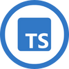
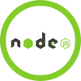
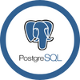
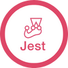
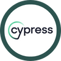

<h2 align="center">👨‍💻 About Me </h2>

A passionate, determined and solution oriented aspiring Full-Stack Developer looking to step into the world of technology. The School of Code bootcamp has given me a strong foundation in agile methodologies, full stack development and communication to flourish in a modern tech firm. I worked in a new team every week to build projects starting from an idea in Miro, to a High-Fi wireframes in Figma and finally coding the solution using industry-leading frameworks like Next.js.
Prior to the coding bootcamp I was briefly a Maths teacher (1 year) and before that I studied Mechanical Engineering.

 

  
 
  
  
   
 

  
<h1 align="center">🛠 Languages and Tools</h1>

  
  
  
  
  
  
  
  
  
  
  
  
  
  
  
  

  

<h1 align="center">💼 Projects</h1>

The README.md of each project goes into details about the specifics of the projects such as entire tech stack used, key learning points and any roadblockers encountered. 

 

|               Project |                                                            |                                                          | Key Tech                 |
| --------------------: | ---------------------------------------------------------- | -------------------------------------------------------- | -------------------- |
| Cheers - Bar Finder | [Github](https://github.com/SchoolOfCode/bc13_final-project_front-end-beast-code) | [Demo](https://bc13-final-project-front-end-beast-code-beast-code.vercel.app/) | Next, React, TypeScript, MongoDB, Various Testing Libraries     |
|          Project Hub | [Github](https://github.com/faseehahmed1/FrontEnd_Solo_HackStreetBoys)        | [Demo](https://connect-project-hub.netlify.app/)         | React, PostgreSQL, Various Testing Libraries     |
|          Portfolio | [Github](https://github.com/faseehahmed1/portfolio)        | [Demo](https://faseehahmed.netlify.app/)         | Next, Tailwind CSS     |
|          Pomodoro Timer | [Github](https://github.com/faseehahmed1/pomodoro-timer)        | [Demo](https://pomodoro-app1.netlify.app/)         | Next, Tailwind CSS     |

 

---

